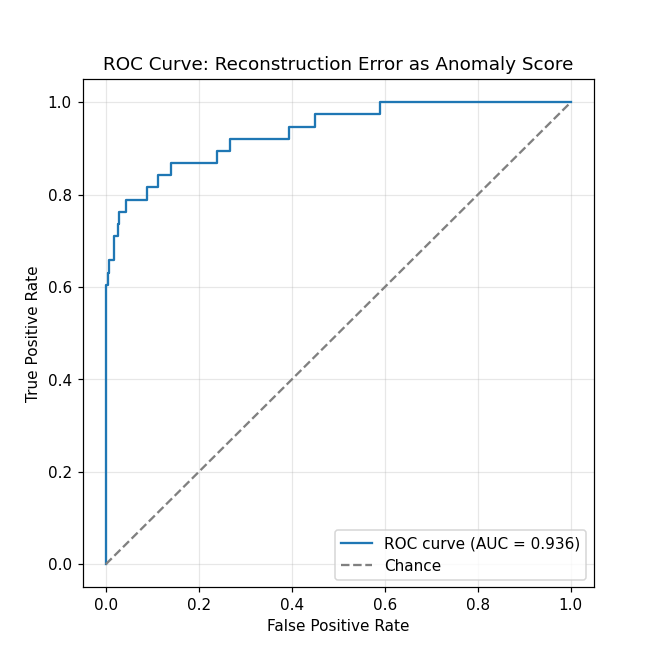

# Network Traffic Anomaly Detection with a Dense Autoencoder

Detects 24-hour base-station traffic profiles that deviate from "normal" behavior, using reconstruction error from a dense autoencoder as the anomaly score.

> **Note on data:** the original analysis was run on a confidential telecom dataset, which cannot be published. This repo uses a **synthetic dataset instead** — generated to match the aggregate per-hour statistics of the original (mean/std of log-traffic and an hour-to-hour correlation structure), with a small set of labeled anomalies (outages, spikes, phase shifts, inversions) injected on top. No real site-level data is included anywhere in this repo or its history. The synthetic version has one advantage the original didn't: ground-truth labels, which allow the pipeline below to be evaluated quantitatively.

## Problem

A telecom network exposes hourly traffic volume for base stations, each summarized as a 24-value daily profile (one value per hour, 0–23). The goal is to flag stations whose daily traffic *shape* is structurally unusual — e.g. an unexpected spike, outage, or phase shift — without assuming labeled examples of "anomalous" behavior are available at training time.

## Approach

1. **Generate** a synthetic dataset (743 stations) calibrated to the real data's aggregate per-hour statistics, with ~5% labeled anomalies injected (outage / spike / phase-shift / inversion).
2. **Normalize** each profile by its own daily mean, so the model learns hourly *shape* rather than absolute traffic volume.
3. **Split** into train/validation (80/20) and run a **grid search** over 6 encoder architectures × 2 learning rates × 3 random seeds, selecting the combination with the lowest mean validation MSE.
4. **Retrain** the selected architecture with early stopping; cache the trained weights and training history to disk so the notebook doesn't retrain on every run.
5. **Score** every station by reconstruction error (RMSE between actual and reconstructed profile) and **threshold** at the 95th percentile of the training-set error distribution.
6. **Validate** both visually (actual vs. reconstructed curves) and quantitatively — precision, recall, F1, ROC-AUC, and per-anomaly-type recall against the injected ground truth.

## Results

- Selected architecture: `24 → 8 → 24` (single 8-unit bottleneck), learning rate 1e-3, mean validation MSE ≈ 0.0148 (averaged over 3 seeds).
- **40 of 743 stations (5.4%)** flagged as anomalous at the 95th-percentile threshold (0.140).
- Against the injected ground truth: **precision 0.68, recall 0.71, F1 0.69, ROC-AUC 0.94**.
- Recall by injected anomaly type: spike 1.00, outage 0.70, phase-shift 0.60, inversion 0.50 — sudden bursts are caught almost every time, while a fully inverted daily cycle (same energy, opposite shape) is the hardest case, as expected for a reconstruction-error-based detector.


*The 5 highest-error stations — mostly injected spikes — where the model's reconstruction (orange) is visibly damped relative to the actual spike (blue).*


*For contrast, the 5 lowest-error stations: reconstruction tracks the actual profile almost exactly.*



*ROC-AUC of 0.94 — reconstruction error is a strong ranking signal for the injected anomalies, well above chance.*

## Repo structure

```
NetworkAnomaliesProject/
├── README.md
├── requirements.txt
├── SDA.ipynb                    # full analysis, notebook entry point
├── tuning_results.csv           # cached architecture/lr search results
├── sda_autoencoder.keras        # cached trained model
├── sda_training_history.pkl     # cached training loss history
└── images/                      # figures embedded in this README
```

## How to run

```bash
pip install -r requirements.txt
jupyter notebook SDA.ipynb
```

Run all cells top to bottom. The dataset is generated in-notebook (no external file needed). The architecture search and final model training are cached to disk (`tuning_results.csv`, `sda_autoencoder.keras`, `sda_training_history.pkl`) — delete those files, or set the `FORCE_RETRAIN_*` flags near the top of their respective cells to `True`, to reproduce the search/training from scratch (~10–15 min on CPU).

## Limitations & next steps

- This is a synthetic stand-in for the confidential original dataset. The generator matches the *aggregate* per-hour statistics of the real data, but the injected anomaly types are a designer's guess at what real anomalies look like — real-world anomalies may differ, so the precision/recall numbers above validate the *methodology*, not a guarantee of production performance.
- The threshold is a single global percentile; it doesn't account for stations whose normal behavior is inherently more variable than others.
- Each day is scored independently; there's no use of history, so a station that is *consistently* unusual every day looks identical to a one-off event.
- Next: benchmark against a simpler baseline (PCA reconstruction error or per-hour z-scores) to quantify what the autoencoder specifically adds; extend to sequence models (e.g. LSTM autoencoder) if multi-day data becomes available; revisit the injected anomaly taxonomy against real incident/outage records once deployed on real traffic.

## Tech stack

Python, pandas, NumPy, scikit-learn, TensorFlow/Keras, Matplotlib
