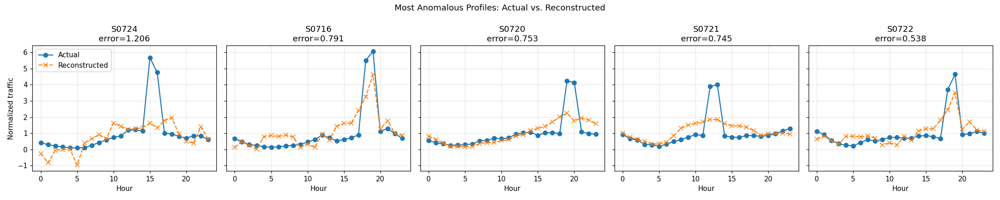
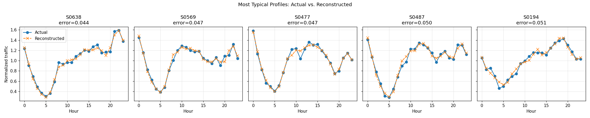

# Network Traffic Anomaly Detection with a Dense Autoencoder

Detects 24-hour base-station traffic profiles that deviate from "normal" behavior, using reconstruction error from a dense autoencoder as the anomaly score. This is a fully unsupervised approach, with no labeled anomalies assumed at any point, ressembling a real world-scenario where labeled anomalies are scarce.

## Problem

A telecom network exposes hourly traffic volume for base stations, each summarized as a 24-value daily profile (one value per hour, 0–23). The goal is to flag stations whose daily traffic *shape* is structurally unusual — e.g. an unexpected spike, outage, phase shift, capacity problems — without assuming labeled examples of "anomalous" behavior are available at training time. This mirrors the real-world constraint that motivated the project: a network operations team doesn't get a pre-labeled list of anomalies, so any workable detection model has to be built and validated without one.

## Data

The original analysis was run on a confidential telecom dataset. `dataset.parquet` is the only data artifact published in this repo, containing a 1,455-row table (`site`, then 24 hourly columns `0`–`23`) generated from a model calibrated to the aggregate per-hour statistics of the original confidential dataset (per-hour mean/std of log-traffic, plus an hour-to-hour correlation structure), using completely artificial site IDs.

No anomaly labels are published alongside this data. That's intentional to keep the detection method honest to the constraint it was actually built under.

## Approach

1. **Normalize** each profile by its own daily mean, so the model learns hourly *shape* rather than absolute traffic volume — this puts small and large stations on equal footing.
2. **Split** into train/validation (80/20) and run a **grid search** over 6 encoder architectures × 2 learning rates × 3 random seeds, selecting the combination with the lowest mean validation MSE.
3. **Retrain** the selected architecture with early stopping; cache the trained weights and training history to disk so the notebook doesn't retrain on every run.
4. **Score** every station by reconstruction error (RMSE between actual and reconstructed profile) and **threshold** at the 95th percentile of the training-set error distribution.
5. **Validate visually**: plot actual vs. reconstructed curves for the most anomalous and most typical stations, since there's no labeled test set to validate against numerically.

## Results

- Selected architecture: `24 → 8 → 24` (single 8-unit bottleneck), learning rate 1e-3, mean validation MSE ≈ 0.0072 (averaged over 3 seeds).
- **73 of 1,455 stations (5.0%)** flagged as anomalous at the 95th-percentile threshold (0.127) — consistent with the ~5% false-positive rate the threshold was designed around.
- Flagged stations show visibly different daily shapes and clear reconstruction failure; the model can't reproduce their sharp spikes or irregular structure. The lowest-error stations, by contrast, are reconstructed almost exactly.



*The 10 highest-error stations — the model's reconstruction (orange) visibly fails to track sharp spikes and irregular shapes in the actual profile (blue).*



*For contrast, the 10 lowest-error stations: reconstruction tracks the actual profile almost exactly.*

## Repo structure

```
NetworkAnomaliesProject/
├── README.md
├── requirements.txt
├── SDA.ipynb                    # full analysis, notebook entry point
├── dataset.parquet              # published dataset, loaded directly by the notebook
├── tuning_results.csv           # cached architecture/lr search results
├── sda_autoencoder.keras        # cached trained model
├── sda_training_history.pkl     # cached training loss history
└── images/                      # figures embedded in this README
```

## How to run

```bash
pip install -r requirements.txt
jupyter notebook SDA.ipynb
```

Run all cells top to bottom. The notebook loads `dataset.parquet` directly — no other data file is needed. Parquet is used rather than `.xlsx` because it's columnar, schema-typed, and compressed, a better fit for a fixed data artifact than a spreadsheet format. The architecture search and final model training are cached to disk (`tuning_results.csv`, `sda_autoencoder.keras`, `sda_training_history.pkl`) — delete those files, or set the `FORCE_RETRAIN_*` flag near the top of their respective cells to `True`, to reproduce the search/training from scratch (~10–15 min on CPU).

## Limitations & next steps

- Without ground truth, there's no way to directly measure precision or recall — flagged stations are strong *candidates* for review, not confirmed anomalies. This is an inherent limitation of unsupervised detection.
- The selected methodology is intended to act as a simple tool that detect anomalous sites candidates that could be shared with mobile operator quality team for further problem inspection and addressing.
- The threshold is a single global percentile; it doesn't account for stations whose normal behavior is inherently more variable than others.
- Each day is scored independently; there's no use of history, so a station that is *consistently* unusual every day looks identical to a one-off event.
- Next: benchmark against a simpler baseline (PCA reconstruction error or per-hour z-scores) to see how much the autoencoder's nonlinearity actually buys over a linear method; extend to sequence models (e.g. LSTM autoencoder) if multi-day data becomes available; cross-check flagged stations against actual incident/outage records, if any exist, to close the loop with a real precision estimate.

## Tech stack

Python, pandas, NumPy, scikit-learn, TensorFlow/Keras, Matplotlib
